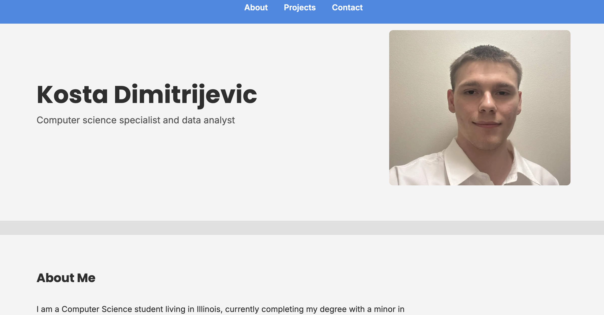

# Portfolio
Kosta Dimitrijevic

A personal portfolio website that showcases my skills, projects, and professional identity as a computer science student focused on computer science and data analysis.

## Live Site
[https://k-dimitrijevic.github.io/Portfolio/]

## About
A personal portfolio website that showcases my skills, projects, and professional identity. 

## Technologies Used
- HTML5
- CSS3 (Flexbox / Grid)
- JavaScript

## Features
- Fully responsive layout for desktop, tablet, and mobile
- Hamburger navigation menu for smaller screens
- Client-side form validation that alerts users if fields are left empty

## Screenshots

## Setup
1. Clone the repository
2. Open index.html in a browser